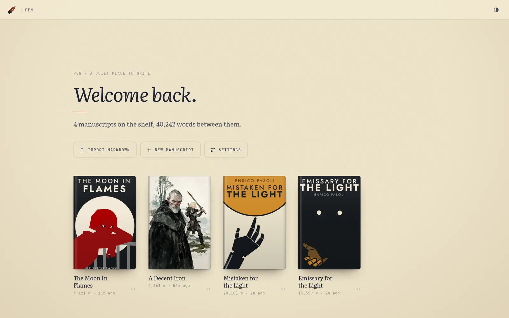
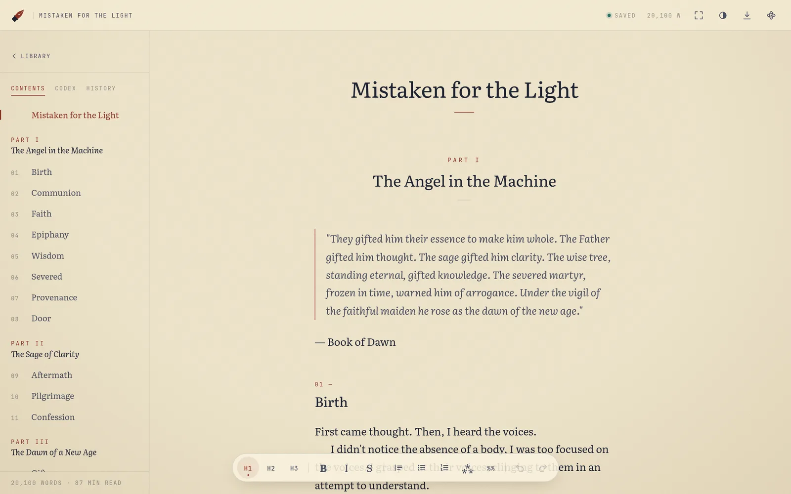
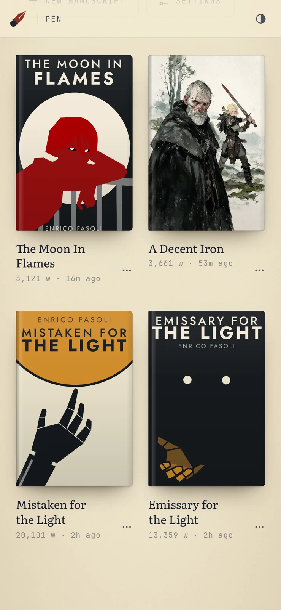
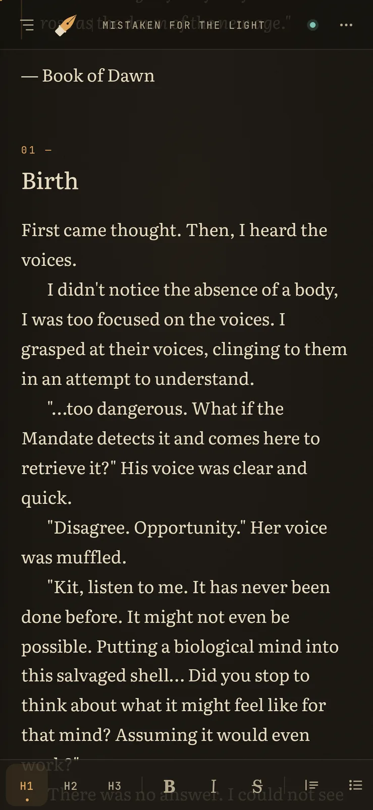
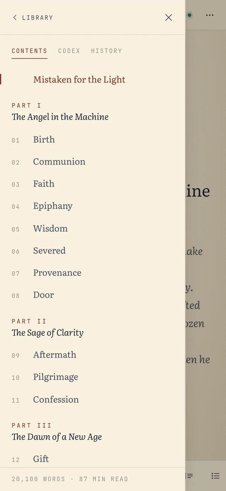
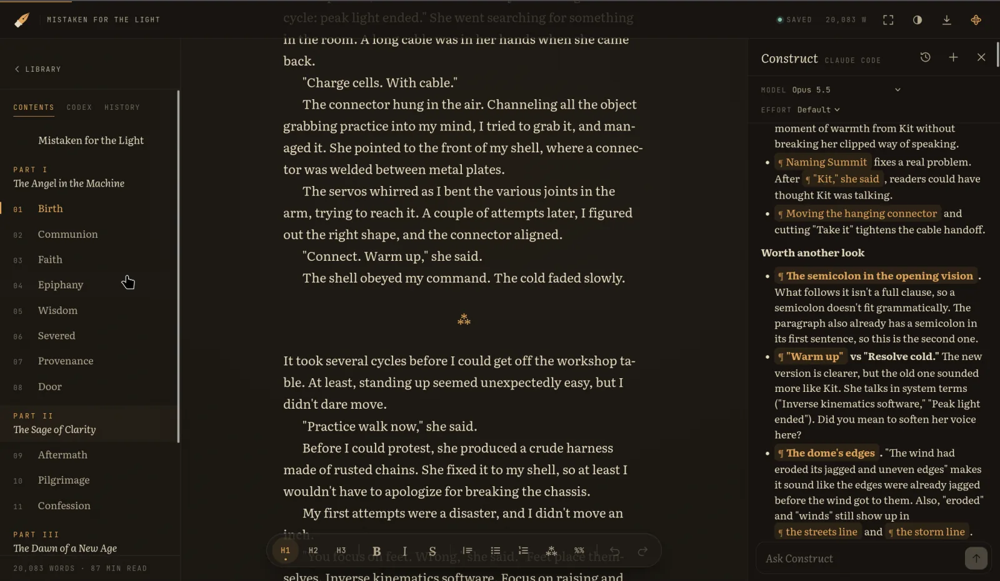

<p align="center">
  
</p>

<h1 align="center">pen</h1>

<p align="center"><em>A quiet place to write fiction.</em><br>
A self-hosted, mobile-first markdown editor for novels, with an AI companion that reads your book but never writes it for you.</p>



## How it works

### Your books, on a shelf

The home page is your library. Every manuscript sits there as a book with its cover art. To set a cover, drop an image onto the book, or pick one from the book's `⋯` menu. Pen shrinks it in the browser before uploading, so a phone photo costs a few kilobytes. Books without art get a cloth-bound cover in a colour of their own.

You can start a new manuscript, or bring one in by importing (or just dropping) a `.md` or `.txt` file anywhere on the page.

### Writing



The editor is WYSIWYG, but the file underneath is plain markdown. What you see is the book, and what's saved is a `manuscript.md` you can open anywhere.

- **Structure from headings.** `#` is the book's title, `##` a part (numbered in roman numerals), `###` a chapter (numbered straight through the book). The outline builds itself from them, follows you as you scroll, and jumps to any chapter.
- **A small toolbar** for what fiction needs: three heading levels, bold, italic, strikethrough, quotes, lists, a scene break (`⁂`), and comments.
- **Comments** written as `%% like this %%` (or `<!-- this -->`) are notes to yourself. They stay in the file but out of the word count.
- **Word count and reading time** for the whole book, always in view.
- **Focus mode** hides everything but the page.
- **Paper and Night themes**, or follow the system.
- **Export** the manuscript as a `.md` file at any time.

### On your phone

<p align="center">
  
  
  
</p>

Pen was built phone-first. The toolbar sits above the keyboard, the outline slides in as a drawer, and the top bar keeps only the save indicator. Everything else lives behind one menu.

### Never losing a word

- **Autosave** kicks in when you pause. Every edit is also backed up in the browser, so going offline or closing a tab loses nothing.
- **Many devices, one book.** Write on the laptop, continue on the phone. Pen pulls the latest text when a tab regains focus. If the same book was changed in two places, you choose which version to keep: pen never merges silently.
- **History.** Name a version whenever you like. Pen also takes one automatically at the start of each writing session and before every restore, and keeps the latest 30 automatic ones.
- **Deletes go to a trash folder**, not into the void.

### The Codex

Beside each manuscript is a Codex: notes on characters, places, timeline and research. Each entry is its own markdown file, edited in the same editor.

### Construct, the AI companion

Construct is a side panel where you can talk to an AI about your book. It can read the manuscript, search it, look through its history, and keep the Codex up to date. It **cannot change the manuscript**, and it **doesn't write prose unless you explicitly ask it to**. When it gives feedback, it points at a passage and tells you what isn't working. The words stay yours.



### Private by default

Pen runs on your own machine, and your books are plain files in a folder. You can lock the whole desk with a password from **Settings**; each new device then has to unlock it once.

## Running it

Pen needs Node 24. With Nix, `nix develop` gives you a shell with everything on the path.

```sh
npm install
npm run dev -- -H 0.0.0.0 -p 3000   # reachable from your phone on the same network
# or, for everyday use:
npm run build && npm start
```

Books are stored in `./data`. Point `PEN_DIR` elsewhere to keep them somewhere else (a synced folder, say).

| Variable | Default | What it does |
| --- | --- | --- |
| `PEN_DIR` | `./data` | Where the library lives |
| `PEN_SESSION_GAP_MS` | 30 minutes | Quiet time after which the next save snapshots a new version |
| `PEN_CONSTRUCT_CLAUDE` | `npx -y @agentclientprotocol/claude-agent-acp@0.84.0` | Command that launches Construct's agent |
| `PEN_INTERNAL_URL` | `http://127.0.0.1:<port>` | Where the agent reaches pen's tool endpoint |

Construct uses [Claude Code](https://claude.com/claude-code) and its login: sign in once with `claude` on the machine running pen. Construct is built using ACP, so it's possible to add support for other agents (such as Pi) with relative ease as long as they support ACP.

## Self-hosting

The repository includes a `Dockerfile` that builds a self-contained image. Everything pen keeps (books, covers, history, the lock, Construct's chats and the agent's own state) lives in a single volume at `/data`, so backing up means copying one folder.

```sh
docker build -t pen .
docker run -d --name pen -p 3000:3000 -v pen-data:/data --restart unless-stopped pen
```

Or with Compose:

```yaml
services:
  pen:
    build: .
    ports:
      - "3000:3000"
    volumes:
      - ./library:/data   # a host folder must be writable by uid 1000
    environment:
      CLAUDE_CODE_OAUTH_TOKEN: ${CLAUDE_CODE_OAUTH_TOKEN}   # optional, for Construct
    restart: unless-stopped
```

**Construct in a container.** There's no interactive login inside the container, so give the agent a credential through the environment:

- `CLAUDE_CODE_OAUTH_TOKEN`, created with `claude setup-token` on any machine where you use Claude Code, runs on your Claude subscription.
- `ANTHROPIC_API_KEY` bills the Anthropic API instead.

Without either, pen works as usual and Construct answers "Authentication required". The agent is baked into the image at the version pen is tested with, so it doesn't need downloading when the container starts.

**Before you expose it:**

- **Set a password right away.** An unlocked pen is open to anyone who can reach it, and the first person to open Settings can lock it with a password of their own.
- **Serve it over HTTPS, or keep it on a private network** such as Tailscale or a VPN. Over plain HTTP the password crosses the network readable, and the session cookie can't be marked `Secure`. Behind a reverse proxy, pass `X-Forwarded-Proto` so pen knows the connection is secure.
- **Back up `/data`.** Pen keeps versions and a trash folder, but they live in the same place as the books.

## Technical details

### Architecture

Pen is a single Next.js 16 app (App Router) with no database. The UI uses [Tiptap 3](https://tiptap.dev) and `@tiptap/markdown` to edit markdown directly, styled with plain CSS.

```
data/                         (or $PEN_DIR)
├── .pen-auth.json            password hash, if the desk is locked
├── .trash/                   deleted books, notes, covers and chats
└── mistaken-for-the-light/   one folder per book
    ├── manuscript.md         the master copy
    ├── cover.webp            cover art (jpg, png, webp, avif or gif)
    ├── versions/             snapshots + index.json
    ├── codex/                one .md per note
    └── construct/            saved conversations
```

- **Storage** (`lib/docs.ts`): every write goes through a single queue and lands atomically (write to a temp file, then rename). Ids are validated slugs, and cover formats are checked by their bytes, not by what the browser claims.
- **Sync and conflicts** (`lib/useAutosave.ts`): each save carries the hash of the text it was based on. If the file changed underneath, the server answers `409` with the current text and the editor asks you what to do. A last-chance save goes out with `sendBeacon` when a tab closes.
- **The lock** (`proxy.ts`, `lib/auth.ts`): an optional password for the whole instance; see [The lock, explained](#the-lock-explained).
- **Pages**: `/` is the library, `/d/<book>` the editor, `/d/<book>/codex/<entry>` a Codex entry, and `/settings` the lock settings. All of them are rendered on the server from the files on disk, so every device opens the latest text.

### The lock, explained

Pen has no user accounts. The lock is a single password for the whole instance, set, changed or removed from **Settings** (changing or removing it asks for the current one). It controls who can reach your books; it doesn't encrypt the files on disk.

- **Storing the password.** Pen never keeps the password itself. It stores a scrypt hash (with a random salt) in `.pen-auth.json` at the root of the library, readable only by the user pen runs as.
- **Staying signed in.** Unlocking a device gives it a session cookie that lasts 90 days. The cookie is `HttpOnly` (page scripts can't read it) and `Secure` over HTTPS, and it holds only an expiry date signed with a secret from `.pen-auth.json`. Nothing about sessions is stored on the server.
- **Signing out.** "Sign out this device" clears that device's cookie. Changing the password replaces the signing secret, which signs out every device at once, except the one that made the change.
- **Checked on every request.** A proxy in front of the app sends anything without a valid session to the unlock screen, or answers `401` for the API. Each page and route handler checks the session again on its own. The unlock screen and its API are the only routes open without a session, besides Construct's tool endpoint, which has a separate per-session token of its own.
- **Guessing is slow.** Each failed attempt takes an extra second, and the whole instance accepts at most 30 password checks a minute.
- **Forgotten password.** Delete `.pen-auth.json` from the library folder. Pen is then unlocked, and you can set a new password.

### AI assistance

Construct is built on the [Agent Client Protocol](https://agentclientprotocol.com) (ACP), so the agent is a separate process that pen talks to, not a library it links against.

```
panel ──SSE/POST──▶ pen server ──ACP (stdio)──▶ agent (Claude Code)
                        ▲                            │
                        └──── MCP over HTTP ◀────────┘
                         /api/construct/mcp (bearer token)
```

- **One agent per book** (`lib/construct/session.ts`), launched on demand and streamed to the panel over server-sent events.
- **Locked down.** Every built-in tool the agent normally has (files, shell, web) is switched off, and it ignores the user's own settings and MCP servers. The only tools it gets are pen's own, served from a small MCP endpoint with a per-session token (`lib/construct/tools.ts`):
  - manuscript, read-only: `outline`, `read_manuscript`, `search`
  - history, read-only: `list_versions`, `read_version`
  - Codex, read-write: `list_codex`, `read_codex_entry`, `create_codex_entry`, `edit_codex_entry`, `write_codex_entry`, `rename_codex_entry`, `delete_codex_entry`

  There is deliberately no tool that writes the manuscript.
- **The brief** (`lib/construct/agents.ts`): the system prompt sets the rules. The prose belongs to the writer; feedback means pointing at passages, not rewriting them; drafting only happens on explicit request; and Codex notes stick to what the writer has established.
- **Context.** Each message tells the agent what you're looking at (the manuscript or a Codex entry) and any text you have selected.
- **Memory across restarts.** Conversations are saved with the agent's session id and resumed through ACP `session/resume`, so a chat picks up where it left off.
- **Model choice.** The panel exposes the agent's model and thinking-effort options, and nothing else.
